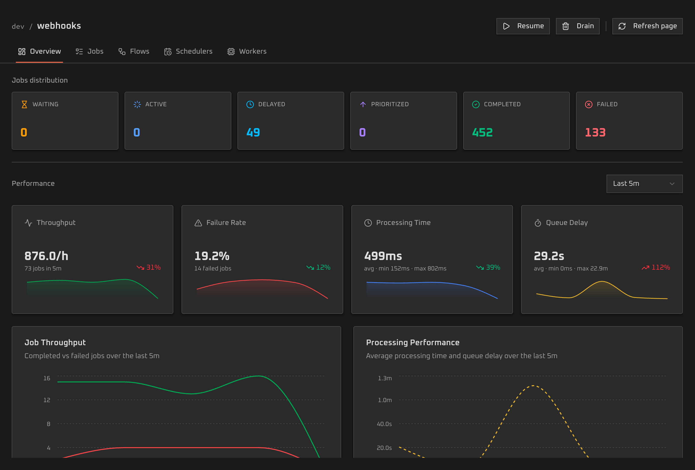
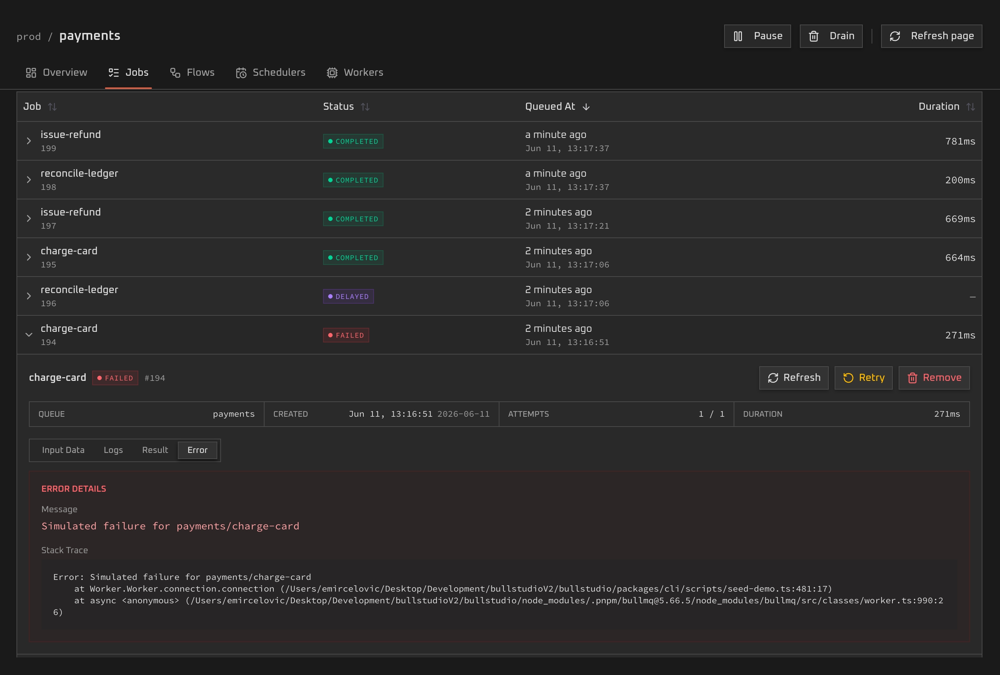
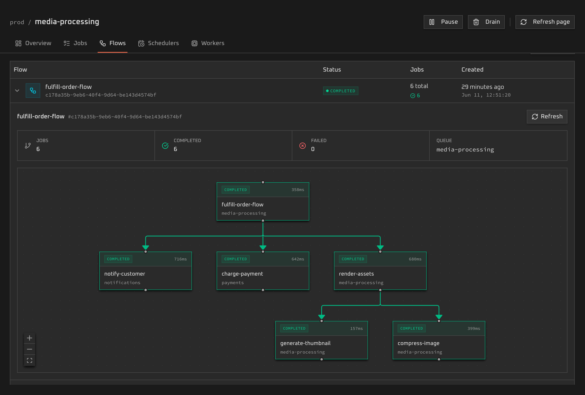

<p align="center">
  
</p>

<h1 align="center">bullstudio</h1>


<p align="center">
  <a href="https://hub.docker.com/r/emirce/bullstudio"></a>
  <a href="https://hub.docker.com/r/emirce/bullstudio"></a>
  
  
  
</p>

<p align="center">
Modern, sleek queue dashboard for <a href="https://docs.bullmq.io/">BullMQ</a> and <a href="https://github.com/OptimalBits/bull">Bull</a>. Run it standalone with one command or embed it in your app.
</p>

<p align="center">View official <a href="https://bullstudio.dev/docs">docs &#8594;</a></p>


<table align="center">
  <tr>
    <td width="30%"></td>
    <td width="30%"></td>
    <td  width="30%"></td>
  </tr>
</table>

## Features

- **Queue overviews** — live queue counts and job states surface stuck, failed, and backed-up work at a glance.
- **Two ways to run** — launch standalone with one command, or embed it inside your existing app.
- **BullMQ & Bull** — works with both BullMQ and legacy Bull queues via adapters.
- **Framework adapters** — support for Hono, Express, Fastify, Next.js, and NestJS.
- **Flow view** — visualize parent/child job trees and trace dependencies across your flows.
- **Job control** — retry, promote, remove, and clean jobs; inspect data, logs, and stack traces.
- **Built-in auth** — protect access with basic authentication or a read-only mode.
- **Docker ready** — run anywhere from the official image, standalone or in a compose stack.

## Quick start

Bullstudio runs in two modes:

- **Standalone mode**: run a separate dashboard process that connects directly to Redis and discovers queues on start up.
- **Embedded mode**: mount Bullstudio inside your app and expose only the queues you supply.

### Standalone

The quickest way to spin up bullstudio is via CLI:

```bash
npx bullstudio -r redis://localhost:6379
```

The dashboard opens at `http://localhost:4000` and connects to your local redis instance on port 6379.

```bash
bullstudio --help
bullstudio -r redis://:password@redis.example.com:6379 -p 8080 --no-open
bullstudio --prefix stage,stage2
bullstudio --username operator --password change-me
```

### Docker

Bullstudio is available as a Docker image:

```bash
docker run -d \
  -p 4000:4000 \
  -e REDIS_URL=redis://host.docker.internal:6379 \
  emirce/bullstudio
```

You can also run it in a Docker compose stack:
```yaml
services:
  bullstudio:
    image: emirce/bullstudio
    ports:
      - "4000:4000"
    environment:
      REDIS_URL: redis://redis:6379
      BULLSTUDIO_USERNAME: operator
      BULLSTUDIO_PASSWORD: change-me

  redis:
    image: redis:7-alpine
```

## Embedded

Use embedded mode if want to access Bullstudio from an existing application that is accessible via a public URL

Install one framework adapter and one queue adapter. Here as an example, we use Hono:

```bash
pnpm add @bullstudio/hono @bullstudio/bullmq-adapter
```

```ts
import { createBullMqQueueAdapter } from "@bullstudio/bullmq-adapter";
import { bullstudio } from "@bullstudio/hono";
import { Queue } from "bullmq";
import { Hono } from "hono";
import IORedis from "ioredis";

const connection = new IORedis(
  process.env.REDIS_URL ?? "redis://localhost:6379",
  {
    maxRetriesPerRequest: null,
  },
);

const emailQueue = new Queue("email", { connection });
const app = new Hono();

app.route(
  "/ops/bullstudio",
  bullstudio({
    queues: [
      createBullMqQueueAdapter(emailQueue, {
        key: "email",
        label: "Email",
      }),
    ],
    protection: {
      type: "basic",
      username: process.env.BULLSTUDIO_USERNAME ?? "operator",
      password: process.env.BULLSTUDIO_PASSWORD ?? "change-me",
    },
  }),
);
```

Open `/ops/bullstudio`. Dashboard assets and the private dashboard API are served under the same mount path.

### Framework Adapters

| Framework | Package | Docs |
| --- | --- | --- |
| Hono | <a href="https://www.npmjs.com/package/@bullstudio/hono">@bullstudio/hono</a> | <a href="https://bullstudio.dev/docs/embedded/hono">Hono docs</a> |
| Express | <a href="https://www.npmjs.com/package/@bullstudio/express">@bullstudio/express</a> | <a href="https://bullstudio.dev/docs/embedded/express">Express docs</a> |
| Fastify | <a href="https://www.npmjs.com/package/@bullstudio/fastify">@bullstudio/fastify</a> | <a href="https://bullstudio.dev/docs/embedded/fastify">Fastify docs</a> |
| Next.js App Router | <a href="https://www.npmjs.com/package/@bullstudio/next">@bullstudio/next</a> | <a href="https://bullstudio.dev/docs/embedded/next">Next.js docs</a> |
| NestJS | <a href="https://www.npmjs.com/package/@bullstudio/nestjs">@bullstudio/nestjs</a> | <a href="https://bullstudio.dev/docs/embedded/nestjs">NestJS docs</a> |

```ts
// Express
import { bullstudio } from "@bullstudio/express";

app.use("/ops/bullstudio", bullstudio({ queues }));
```

```ts
// Fastify
import { bullstudio } from "@bullstudio/fastify";

await app.register(bullstudio({ queues }), {
  prefix: "/ops/bullstudio",
});
```

```ts
// app/ops/bullstudio/[[...bullstudio]]/route.ts
import { bullstudio } from "@bullstudio/next";

export const runtime = "nodejs";
export const dynamic = "force-dynamic";

export const { GET, HEAD, POST } = bullstudio({
  mountPath: "/ops/bullstudio",
  queues,
});
```

### Queue Adapters
Bullstudio supports BullMQ and Bull (legacy) queues. You simply wrap your queue in the according adapter:
```ts
import { createBullMqQueueAdapter } from "@bullstudio/bullmq-adapter";

const queue = createBullMqQueueAdapter(emailQueue, {
  key: "email",
  label: "Email",
});
```

```ts
import { createBullQueueAdapter } from "@bullstudio/bull-adapter";

const queue = createBullQueueAdapter(emailQueue, {
  key: "email",
  label: "Email",
});
```

Embedded mode only shows supplied queues. Bullstudio does not discover all Redis queues in embedded mode and does not close host-owned queue connections.

### Embedded Options

```ts
bullstudio({
  queues,
  readOnly: true,
  protection: {
    type: "basic",
    username: "operator",
    password: process.env.BULLSTUDIO_PASSWORD ?? "change-me",
  },
  dashboardIdentity: {
    title: "Production Queues",
  },
  documentIdentity: {
    title: "Queue Ops",
    favicon: "/favicon.ico",
  },
});
```

Set `protection: { type: "disabled" }` only when your host application protects the mount path.

## Runnable Examples

| Framework | Command |
| --- | --- |
| Hono | `pnpm --filter @bullstudio/example-hono-bullmq-embedded dev` |
| Express | `pnpm --filter @bullstudio/example-express-bullmq-embedded dev` |
| Fastify | `pnpm --filter @bullstudio/example-fastify-bullmq-embedded dev` |
| Next.js App Router | `pnpm --filter @bullstudio/example-next-bullmq-embedded dev` |
| NestJS | `pnpm --filter @bullstudio/example-nestjs-bullmq-embedded dev:express` |


## Tech stack

Bullstudio's core is built with

- <a href="https://www.typescriptlang.org/">Typescript</a>
- <a href="https://react.dev/">React</a>
- <a href="https://tailwindcss.com/">Tailwind</a>
- <a href="https://tanstack.com/router/latest">Tanstack Router</a> + <a href="https://tanstack.com/query/latest">Query</a>
- <a href="https://trpc.io/">tRPC</a>

## Development

For detailed development guidelines visit the <a href="https://bullstudio.dev/docs/development">development section</a> in the docs.

## License

MIT
